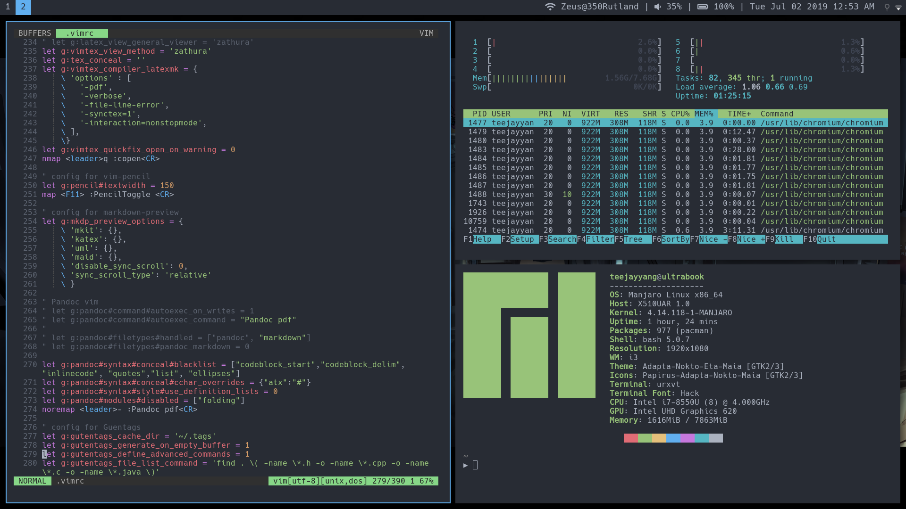
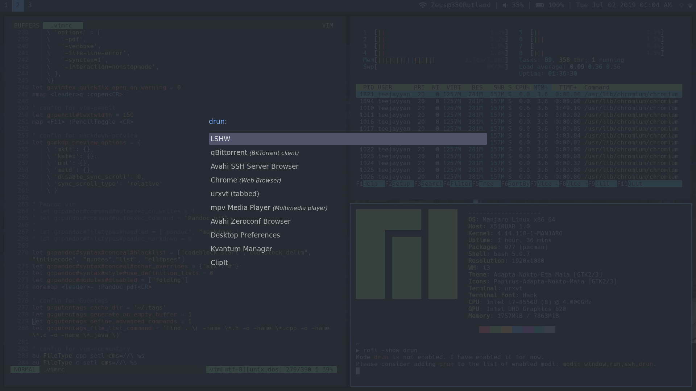

# dotfiles
Configs for Linux

# Software
```
distro          ->  manjaro
de/wm           ->  i3-gaps w/ polybar
editor          ->  vim
file explorer   ->  ranger
image viewer    ->  sxiv
pdf viewer      ->  zathura
shell           ->  bash
terminal        ->  urxvt
dmenu           ->  rofi
```

# Screenshots



# Installation

1. Clone the repository
```
git clone https://github.com/TeeJayYang/dotfiles.git
cd dotfiles
```

2. Install i3 gaps (works on Solus and Ubuntu, untested on other distros)
```
sudo bash installi3gaps.sh
```

3. Create and source a virtual environment
```
virtualenv --python=python3.6 venv
source venv/bin/activate
```

3. Install and run `dotinstall` (and compile `xrdb` from source optionally)
```
pip install dotinstall
dotinstall
```

4. Restart your computer and select i3 as your desktop environment
