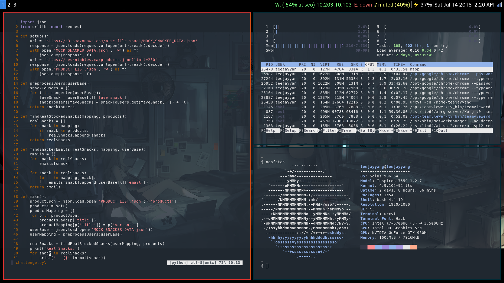

# dotfiles
Configs for Linux

# Software
```
distro          ->  solus
de/wm           ->  i3-gaps w/ i3bar
editor          ->  vim
file explorer   ->  ranger
image viewer    ->  sxiv
pdf viewer      ->  zathura
shell           ->  bash
terminal        ->  urxvt
dmenu           ->  rofi
```

# Screenshots

